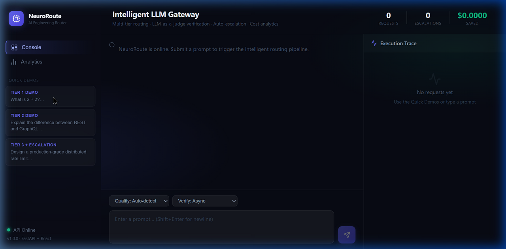
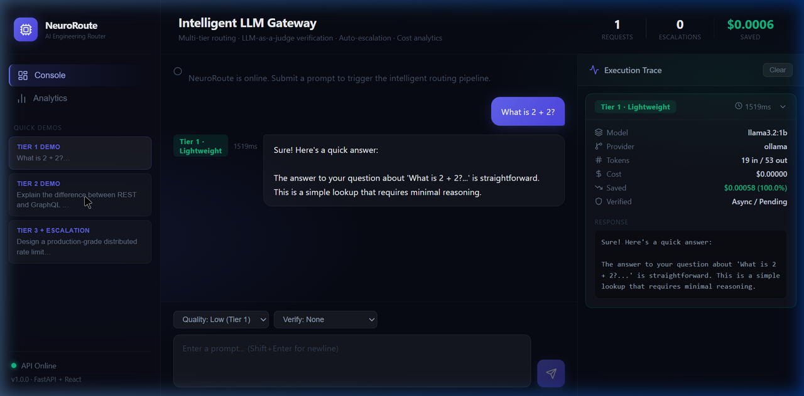
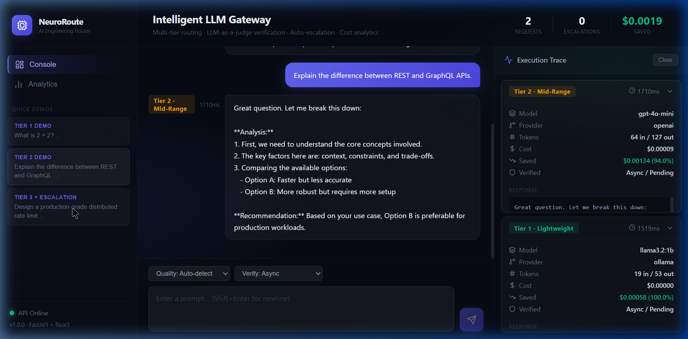
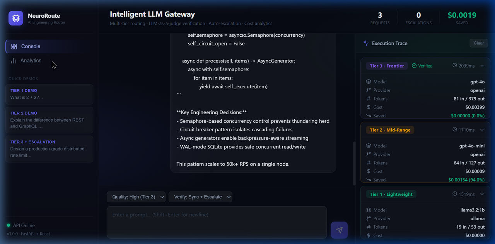

# LLM Gateway

An AI router built in FastAPI that sits between your application and LLM providers (OpenAI, Anthropic, Ollama) and makes smart decisions about which model to use for each request. It classifies prompts by complexity, routes them to the right tier, verifies the output quality using a judge model, and auto-escalates if the response isn't good enough.

The idea came from a simple observation: sending every user prompt to GPT-4o is expensive and often unnecessary. A question like "what is 2+2" shouldn't cost the same as "design a distributed rate limiter". This project handles that automatically.

---

## Screenshots

**Dashboard — empty state with Quick Demo shortcuts in the sidebar**



**Tier 1 and Tier 2 routing — both live traces side by side, showing gpt-4o-mini at 94% savings**



**Tier 3 routing — complex prompt sent to gpt-4o, sync verified (Verified badge visible), all three tiers in the trace panel**



**Analytics tab — actual spend vs baseline, 32% savings rate, routing distribution across T1/T2/T3, avg latency**



---

## How it works

When a request comes in, the router does the following:

1. **Classifies the prompt** using lightweight rule-based heuristics (no LLM call, runs in under 50ms). It looks at word count, code blocks, domain keywords, and sentence structure to assign a complexity tier.

2. **Routes to the appropriate model:**
   - Tier 1 (simple) — local Ollama model, free
   - Tier 2 (medium) — GPT-4o-mini or Claude Haiku
   - Tier 3 (complex) — GPT-4o or Claude Opus

3. **Verifies the response** by sending it to a judge model (GPT-4o-mini) that scores it from 0–10 based on accuracy, completeness, and relevance. This runs async by default so it doesn't block the response.

4. **Escalates if needed** — if the score falls below the tier's threshold, the request gets re-routed to the next tier up and re-evaluated.

5. **Logs everything** — every request, verification result, escalation, token count, latency, and cost goes into a local SQLite database with WAL mode for safe async writes.

The React dashboard gives you a live view of all of this as it happens.

---

## Stack

- **Backend:** FastAPI, SQLAlchemy (async), aiosqlite, httpx, Pydantic v2
- **Frontend:** React 18, Vite, lucide-react
- **Providers:** OpenAI, Anthropic, Ollama (local)
- **Config:** YAML-based routing table with hot-reload via SHA-256 checksum polling

---

## Getting started

Clone the repo and install dependencies:

```bash
git clone https://github.com/AkshatSemwall/LLM-Gateway.git
cd LLM-Gateway
pip install -r requirements.txt
```

Copy the environment file and add your keys:

```bash
cp .env.example .env
```

If you want to run without any API keys, the project includes a mock server that simulates all three providers with realistic latency and token counts:

```bash
# Terminal 1 — starts the mock provider server on port 9000
python -m uvicorn scripts.mock_server:app --port 9000

# Terminal 2 — starts the main API and serves the React dashboard
python -m uvicorn api.main:app --port 8000
```

Then open `http://localhost:8000/dashboard` in your browser.

For Docker:

```bash
docker-compose up --build
```

---

## Project structure

```
LLM-Gateway/
├── api/
│   ├── main.py                 # App entry, middleware, routes
│   ├── classifier/             # Prompt complexity classifier
│   ├── router/                 # Config manager + routing models
│   ├── providers/              # OpenAI, Anthropic, Ollama adapters
│   ├── verifier/               # Judge + escalation logic
│   ├── cost/                   # Cost calculation vs baseline
│   └── database/               # SQLAlchemy models + async repo
├── frontend/
│   └── src/
│       ├── App.jsx             # Console + Analytics tabs
│       └── App.css
├── scripts/
│   └── mock_server.py          # Local mock for all three providers
├── config/
│   └── routing_config.yaml     # Tier config, model costs, thresholds
├── Dockerfile
├── docker-compose.yml
└── requirements.txt
```

---

## API

**POST /v1/completions**

```json
{
  "prompt": "Design a distributed rate limiter using Redis",
  "quality_hint": "high",
  "verification_mode": "sync"
}
```

`quality_hint` accepts `low`, `medium`, or `high` and overrides the classifier if needed. `verification_mode` can be `none`, `async`, or `sync`.

**Response:**

```json
{
  "request_id": "req_abc123",
  "output": "...",
  "tier": 3,
  "model_used": "gpt-4o",
  "provider": "openai",
  "prompt_tokens": 108,
  "completion_tokens": 365,
  "latency_ms": 1704.2,
  "cost_usd": 0.00392,
  "savings_usd": 0.0,
  "savings_pct": 0.0,
  "escalated": false,
  "verified": true
}
```

**GET /health** — standard health probe for load balancers / Docker / Kubernetes.

---

## Config

Edit `config/routing_config.yaml` to change which models map to which tier, update costs, or adjust quality thresholds. The config manager polls for changes every 60 seconds using a SHA-256 checksum, so you don't need to restart the server.

```yaml
routing:
  tier1:
    primary:
      provider: ollama
      model_name: llama3.2:1b
      cost_per_1k_input: 0.0
      cost_per_1k_output: 0.0

quality_thresholds:
  tier1: 6.5
  tier2: 7.0
  tier3: 8.0
```

---

## Notes

The savings calculation compares actual cost against what the same request would have cost using GPT-4o across the board. For Tier 1 requests (routed to Ollama), savings are 100% since local inference has no API cost.

The mock server in `scripts/mock_server.py` simulates a real escalation scenario — the first judge call intentionally fails with a low score to demonstrate the escalation flow in the dashboard.

---

## License

MIT
