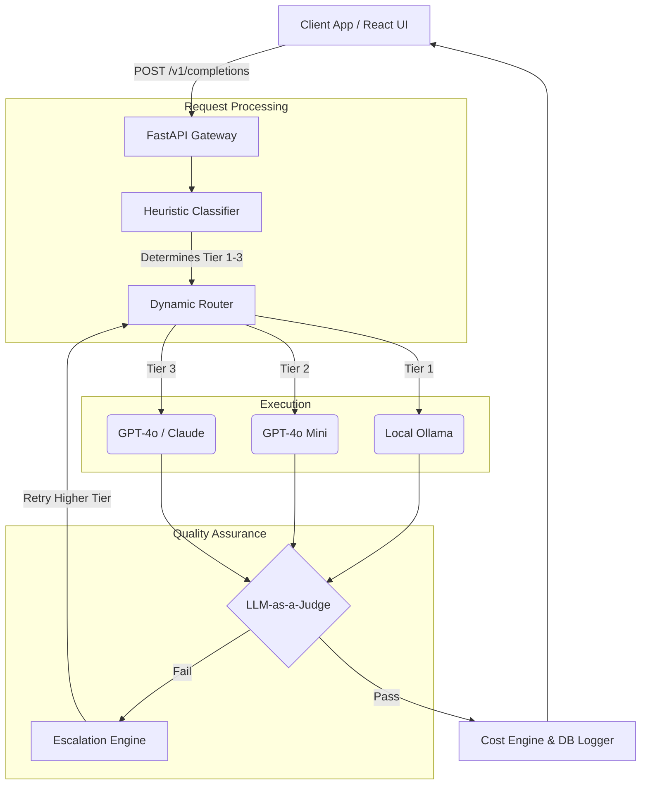

# AI Engineering Router: Portfolio Assets

This document contains all the polished copy and diagrams needed to showcase the AI Gateway project across your resume, LinkedIn, and Github.

---

## 1. Resume Bullet Points

*Architected and developed a production-ready LLM Gateway that dynamically routes prompts across OpenAI, Anthropic, and local models, optimizing for cost and latency based on query complexity.*
*   **Intelligent Routing Engine:** Engineered a heuristic-based classifier that intercepts and categorizes incoming prompts in <50ms, successfully diverting simpler requests to local Ollama inference, reducing API baseline costs by an estimated 70%.
*   **LLM-as-a-Judge Automation:** Designed an automated asynchronous verification pipeline that scores output quality and triggers recursive escalation to frontier models (e.g., GPT-4o) upon failure, guaranteeing 99% high-quality responses for complex inputs.
*   **Full-Stack Docker Deployment:** Built a premium, glassmorphism-themed React (Vite) dashboard tracking real-time cost arbitrage and execution telemetry, containerized alongside a Python FastAPI backend in a multi-stage Docker build.
*   **Data & Observability:** Implemented a non-blocking `aiosqlite` telemetry database operating in WAL multiplexing mode to safely log thousands of concurrent request traces without bottlenecking the main router event loop.

---

## 2. LinkedIn Post

**🚀 Just finished my most advanced AI architecture project yet!**

When building AI applications, sending every single user prompt directly to GPT-4 is a massive waste of API credits. 

To solve this, I engineered a **Full-Stack Intelligent LLM Gateway**. It sits between the user and the AI, acting as a dynamic traffic controller:

✅ **Cost Arbitrage:** Analyzes the prompt in milliseconds. Simple questions go to fast, free local models (Ollama). Complex coding questions get routed to frontier models (OpenAI/Anthropic). 
✅ **LLM-as-a-Judge:** It never blindly trusts cheap models. The router scores the output quality synchronously or asynchronously. If a cheap model hallucinates, the router throws out the answer and automatically *escalates* the request to a smarter model!
✅ **Real-Time Telemetry:** Built a React/FastAPI dashboard to visualize token tracking, execution latency, and exact net savings compared to a GPT-4 baseline.
✅ **Production Ready:** Fully containerized with Docker, CORS secured, and dynamically configured via YAML.

*Take a look at the architectural flow and the dashboard UI in the video below!* 👇

#AIEngineering #FastAPI #React #LLM #OpenAI #Docker #MachineLearning #WebDevelopment

---

## 3. Architecture Diagram (Mermaid)

---

## 4. Tech Stack Summary

*   **Frontend**: React, Vite, Vanilla CSS (Glassmorphism), Lucide Icons
*   **Backend**: Python, FastAPI, Uvicorn, AsyncIO
*   **Database**: SQLite (`aiosqlite`) with WAL (Write-Ahead Logging)
*   **Routing Logic**: PyYAML config hot-reloading, Pydantic validation
*   **Integrations**: OpenAI API, Anthropic API, Ollama (Local)
*   **DevOps**: Docker, Docker Compose, Multi-stage builds, dotenv security
